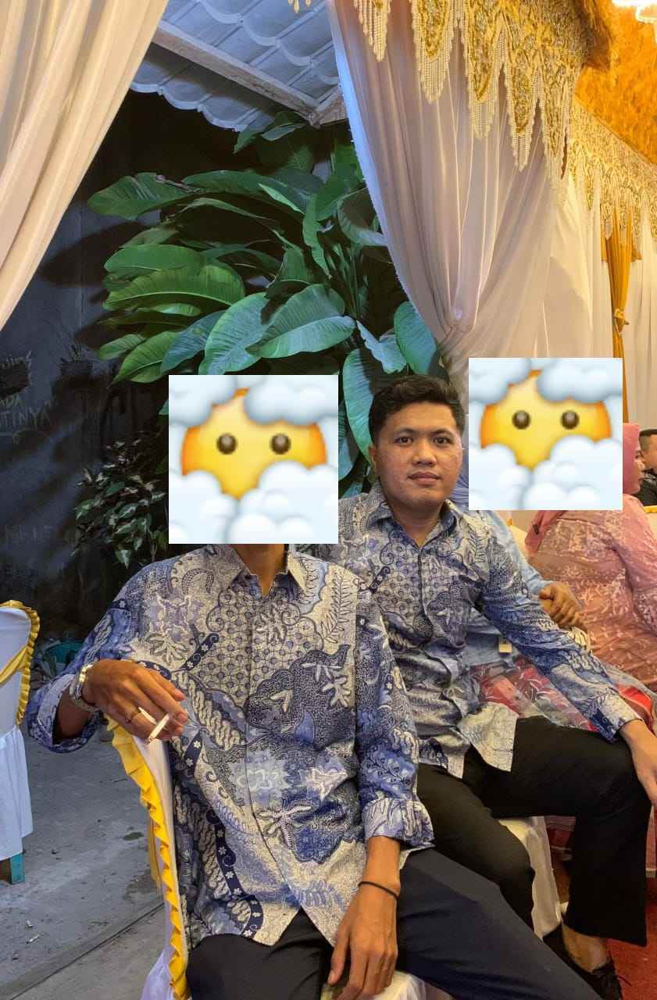

<!DOCTYPE html>
<html lang="id">
<head>
  <meta charset="UTF-8">
  <meta name="viewport" content="width=device-width, initial-scale=1.0">
  <title>Polling Jodoh Imam Guswali</title>
  

  
</head>

<body>

  <h1>📊 Polling Jodoh Nasional</h1>

  

    <h2>Menurut Anda...</h2>
    
<strong>Apakah Imam Guswali sudah waktunya menikah? 😭🤣</strong>

    <button onclick="vote(0)">😇 Sudah banget, kasihan</button>
    <button onclick="vote(1)">🤔 Sudah, tapi nunggu calon</button>
    <button onclick="vote(2)">😂 Belum, masih fokus healing</button>
    <button onclick="vote(3)">🫣 Jangan ditanya dulu</button>

    

  

  <footer>
    *Polling ini 100% bercanda. Imam harap bersabar 🙏😂
  </footer>

  

</body>
</html>
